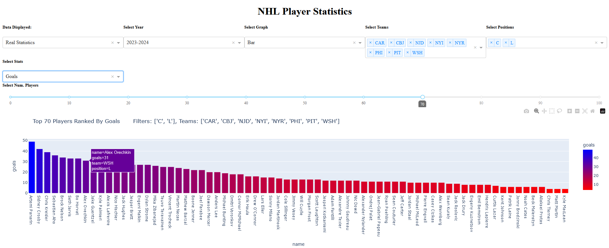
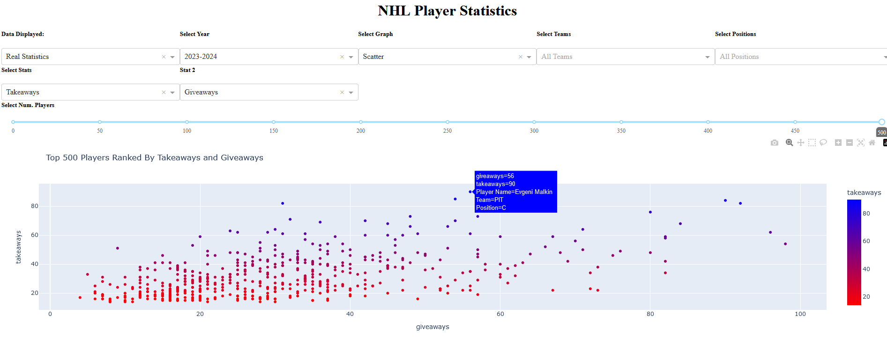
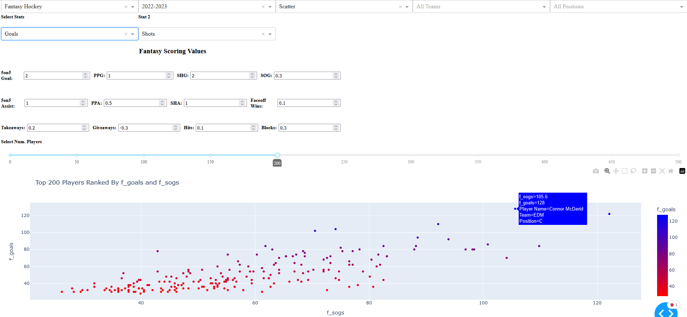
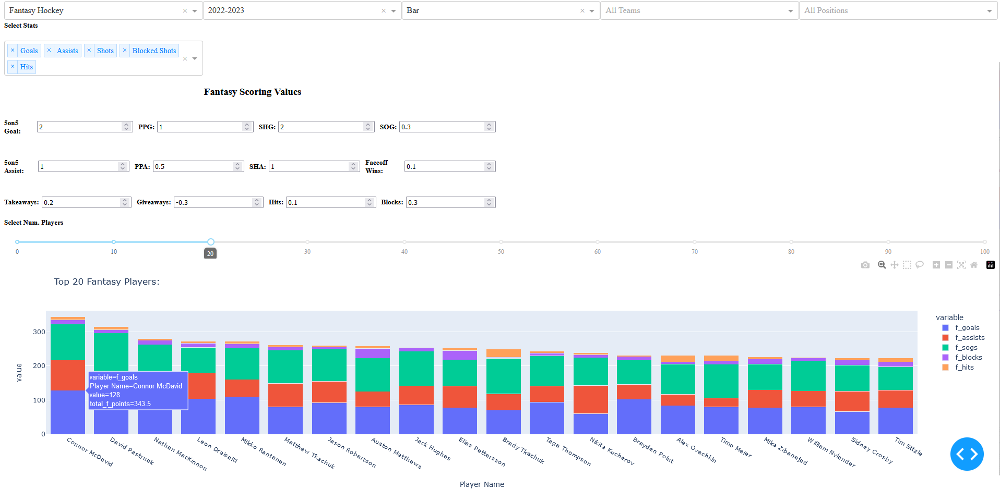
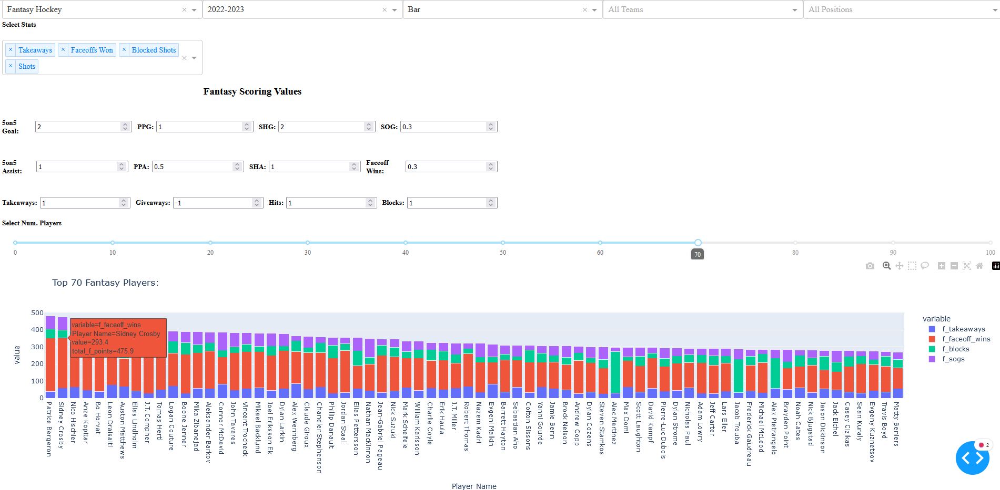

<h1> Hockey Data Visualization App </h1>

<h2> Description </h2>
<b>This is a small application that uses Dash to display real or fantasy statistics over the past 5 years in either a bar/scatter graph format.</b>

- The main goal of this app was to gain experience using python, PostgreSQL, and work with small-medium sized data files.

Each year of data was individually downloaded from https://moneypuck.com as .csv files. Using PostgreSQL the data was filtered to ignore the
irrelevant stats and combine the relevant stats into a single table for each year for easy reference.

The program follows a simple MVC format to display a bar/scatter plot of the selected and filtered stats with the option to 
modify the fantasy value of these stats.

<b> Example Displays: </b>

<b>Bar graph for the 2023-2024 season for the metropolitan teams C,LW goals. </b>

<b>Scatter plot of the 2023-24 season for all teams, all positions, top 500 players in takeaways(Y) and giveaways(X) </b>

<b>Fantasy hockey scatter plot: 2022-23 season, all teams, all positions, Goals(Y), Shots(X), top 200 players </b>

<b>Fantasy hockey bar graph: 2022-23 season, all teams, all positions, various stats for the top 20 players</b>

<b>Fantasy hockey bar graph: 2022-23 season, all teams, all positions, various stats using unique fantasy stat values for the top 70 players.</b>

